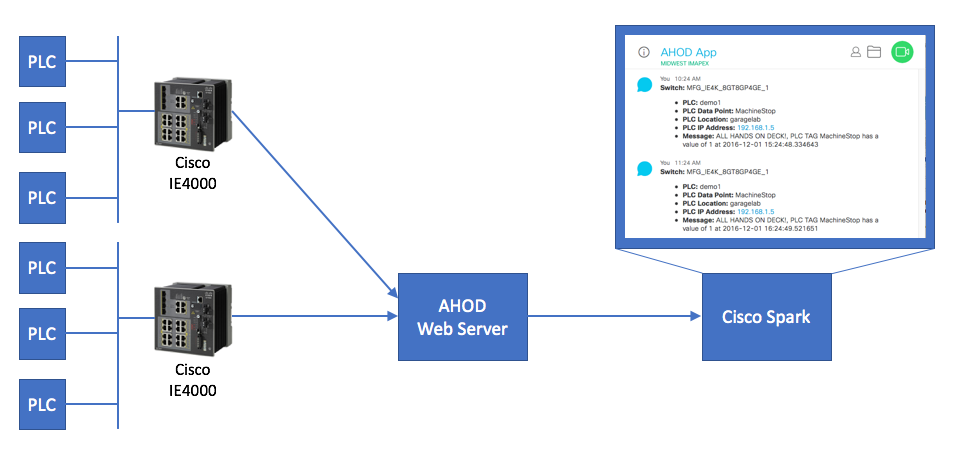
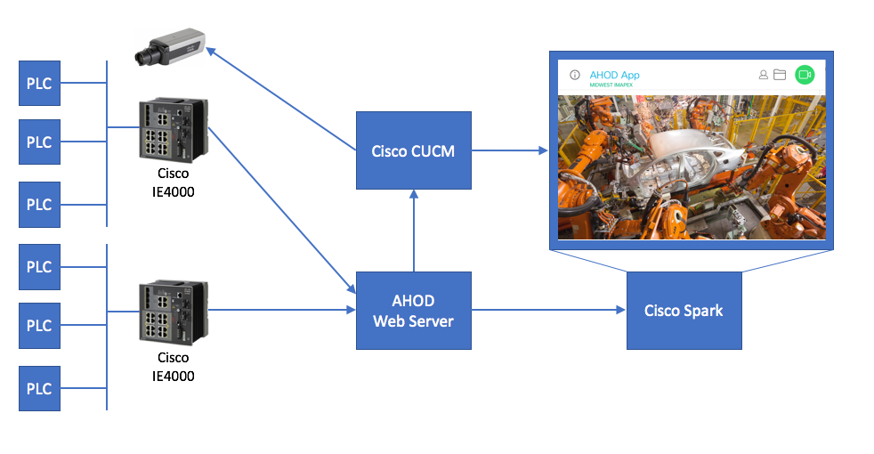

# All Hands On Deck IoT Demo - Home Repository
## Home repository for the IMAPEX All Hands On Deck IoT demo

### The purpose of this demo is to show how the IE4000 IoT Switch can be used to run scripts to poll for specific data from PLC's. In this demo, when a specific value matches a trigger the PLC information is posted to a web application, stored in a database and POSTED to a Cisco Spark room to alert users of the event.

#### In order to build this demo the following steps are required
* Note: A Mantle environment must exist (members of IMAPEX have access to an environment)
* Step 1. Deploy the [Cisco IE4000 IOx Switch PLC application](https://github.com/imapex/ahod_PLC_IOX) onto the IE4000 switch
* Step 2. Create and build the docker container on Mantle by following the instructions in [Web Service Container Build scripts](https://github.com/imapex/ahod_websvc)
* Step 3. Deploy the [Web Service Application](https://github.com/imapex/ahod_webapp) into the container created in step 1

#### Phase 1 Diagram

 

### Future phases of this project will trigger an event to initiate a video call into the Spark room to view the area associated with the PLC.

#### Future Phase Diagram

 
